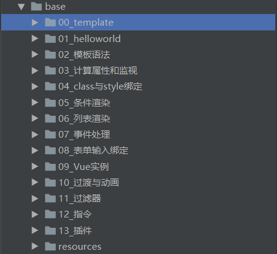
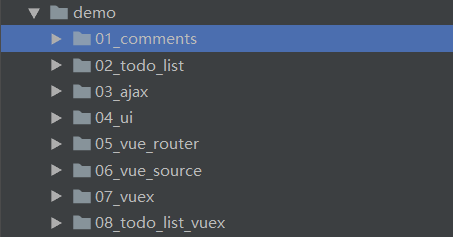

# 尚硅谷Vue全家桶

## 主要目录介绍

### 1. base
该目录存放Vue的基本使用样例，目录如下图所示  
  

### 2. demo
该目录存放对Vue一些模块进行使用尝试，目录如下图所示  
  

## 使用说明

### 1. 普通html  
>直接使用浏览器打开页面即可

### 2. vue项目
> cd demo/【项目目录】例：cd demo/01_comments  
> npm run dev  或者 npm start  
> 访问：http://localhost:8080/

